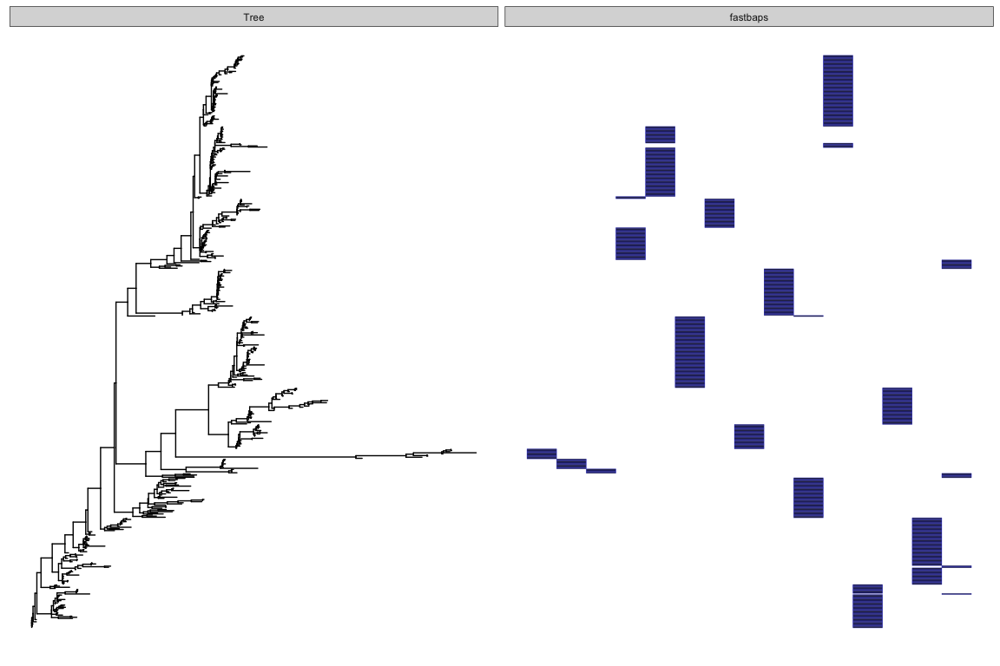
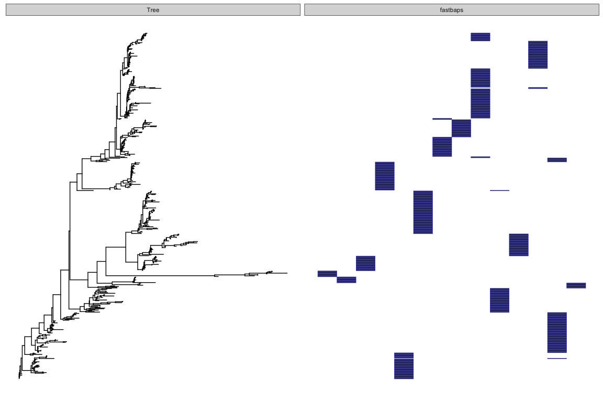

<!-- README.md is generated from README.Rmd. Please edit that file -->
<!-- [](https://travis-ci.org/gtonkinhill/fastbaps) -->
fastbaps
========

Installation
------------

`fastbaps` is currently available on github. It can be installed with `devtools`

``` r
install.packages("devtools")

devtools::install_github("gtonkinhill/fastbaps")
```

If you would like to also build the vignette with your installation run:

``` r
devtools::install_github("gtonkinhill/fastbaps", build_vignettes = TRUE)
```

Quick Start
-----------

Run fastbaps

``` r
# devtools::install_github('gtonkinhill/fastbaps')
library(fastbaps)
library(ape)

fasta.file.name <- system.file("extdata", "seqs.fa", package = "fastbaps")
sparse.data <- import_fasta_sparse_nt(fasta.file.name)
baps.hc <- fast_baps(sparse.data)
#> [1] "Calculating initial clustering..."
#> [1] "Calculating initial dk values..."
#> [1] "Clustering using hierarchical Bayesian clustering..."
best.partition <- best_baps_partition(sparse.data, as.phylo(baps.hc))
#> [1] "Calculating node marginal llks..."
#> [1] "Finding best partition..."
```

The fast BAPS algorithm is based on applying the hierarchical Bayesian clustering (BHC) algorithm of (Heller and Ghahramani 2005) to the problem of clustering genetic sequences using the same likelihood as BAPS (Cheng et al. 2013). The Bayesian hierarchical clustering can be initiated with sequences as individual clusters or by running a faster conventional hierarchical clustering initially followed by BHC of the resulting clusters.

The algorithm has been written to take advantage of fast sparse matrix libraries and is able to handle 1000's of sequences and 100,000's of SNPs in under an hour on a laptop using a single core.

Alternatively, we can condition on an initial phylogentic or hierarchical tree and provide the partition of the hierarchy that maximises the BAPS likelihood. This is useful if the user is mainly interested in partitioning an already calculated phylogeny. We have also noticed that partitioning a hierarchy built using ward.D2 distance gives very reasonable results, very quickly.

------------------------------------------------------------------------

Libraries
---------

``` r
library(fastbaps)
library(rhierbaps)
library(ggtree)
library(phytools)
library(ggplot2)

set.seed(1234)
```

Loading data
------------

We first need to load a multiple sequence alignment into sparse format. We can choose between the original BAPS prior or a prior proportional to the mean frequency of each allele in the population.

``` r
fasta.file.name <- system.file("extdata", "seqs.fa", package = "fastbaps")
sparse.data <- import_fasta_sparse_nt(fasta.file.name)
```

Running fastbaps
----------------

It is a good idea to choose `k.init` to be significantly larger than the number of clusters you expect. By default it is set to the number of sequences / 4.

``` r
baps.hc <- fast_baps(sparse.data)
#> [1] "Calculating initial clustering..."
#> [1] "Calculating initial dk values..."
#> [1] "Clustering using hierarchical Bayesian clustering..."
```

This provides a Bayesian hierarchical clustering of the data. To obtain the partition of this hierarchy that maximises the marginal likelihood run

``` r
best.partition <- best_baps_partition(sparse.data, baps.hc)
#> [1] "Calculating node marginal llks..."
#> [1] "Finding best partition..."
```

We can compare the log marginal likelihood with that obtained using hierbaps.

``` r
snp.matrix <- load_fasta(fasta.file.name)
hb.results <- hierBAPS(snp.matrix, max.depth = 2, n.pops = 20, quiet = TRUE)

calc_marginal_llk(sparse.data, hb.results$partition.df$`level 1`)
#> [1] -49592.83
calc_marginal_llk(sparse.data, best.partition)
#> [1] -49499.56
```

We can also plot the output of the two algorithms along with a pre-calculated tree using ggtree (Yu et al. 2017).

``` r
newick.file.name <- system.file("extdata", "seqs.fa.treefile", package = "fastbaps")
iqtree <- phytools::read.newick(newick.file.name)
plot.df <- data.frame(id = colnames(sparse.data$snp.matrix), val = hb.results$partition.df$`level 1`, 
    fastbaps = best.partition, stringsAsFactors = FALSE)

gg <- ggtree(iqtree)
gg <- gg %<+% data.frame(id = colnames(sparse.data$snp.matrix), hierBAPS = hb.results$partition.df$`level 1`)
gg <- gg + geom_tippoint(aes(color = factor(hierBAPS)))

f1 <- facet_plot(gg, panel = "hierBAPS", data = plot.df, geom = geom_tile, aes(x = val), 
    color = "red")
f2 <- facet_plot(f1, panel = "fastbaps", data = plot.df, geom = geom_tile, aes(x = fastbaps), 
    color = "blue")
f2
```



We can compare this result to other priors, either flat or the population mean based prior of Heller et al.

``` r
sparse.data <- optimise_prior(sparse.data, type = "flat")
#> [1] "Optimised hyperparameter: 0.02"

baps.hc <- fast_baps(sparse.data)
#> [1] "Calculating initial clustering..."
#> [1] "Calculating initial dk values..."
#> [1] "Clustering using hierarchical Bayesian clustering..."
best.partition <- best_baps_partition(sparse.data, baps.hc)
#> [1] "Calculating node marginal llks..."
#> [1] "Finding best partition..."

plot.df <- data.frame(id = colnames(sparse.data$snp.matrix), val = hb.results$partition.df$`level 1`, 
    fastbaps = best.partition, stringsAsFactors = FALSE)

gg <- ggtree(iqtree)
gg <- gg %<+% data.frame(id = colnames(sparse.data$snp.matrix), hierBAPS = hb.results$partition.df$`level 1`)
gg <- gg + geom_tippoint(aes(color = factor(hierBAPS)))

f1 <- facet_plot(gg, panel = "hierBAPS", data = plot.df, geom = geom_tile, aes(x = val), 
    color = "red")
f2 <- facet_plot(f1, panel = "fastbaps", data = plot.df, geom = geom_tile, aes(x = fastbaps), 
    color = "blue")
f2
```


``` r
sparse.data <- optimise_prior(sparse.data, type = "hc")
#> [1] "Optimised hyperparameter: 0.286"

baps.hc <- fast_baps(sparse.data)
#> [1] "Calculating initial clustering..."
#> [1] "Calculating initial dk values..."
#> [1] "Clustering using hierarchical Bayesian clustering..."
best.partition <- best_baps_partition(sparse.data, baps.hc)
#> [1] "Calculating node marginal llks..."
#> [1] "Finding best partition..."

plot.df <- data.frame(id = colnames(sparse.data$snp.matrix), val = hb.results$partition.df$`level 1`, 
    fastbaps = best.partition, stringsAsFactors = FALSE)

gg <- ggtree(iqtree)
gg <- gg %<+% data.frame(id = colnames(sparse.data$snp.matrix), hierBAPS = hb.results$partition.df$`level 1`)
gg <- gg + geom_tippoint(aes(color = factor(hierBAPS)))

f1 <- facet_plot(gg, panel = "hierBAPS", data = plot.df, geom = geom_tile, aes(x = val), 
    color = "red")
f2 <- facet_plot(f1, panel = "fastbaps", data = plot.df, geom = geom_tile, aes(x = fastbaps), 
    color = "blue")
f2
```


we can also investigate multiple levels

``` r
sparse.data <- import_fasta_sparse_nt(fasta.file.name, prior = "baps")
multi <- multi_res_baps(sparse.data)

plot.df <- data.frame(id = colnames(sparse.data$snp.matrix), val = hb.results$partition.df$`level 1`, 
    fastbaps = multi$`Level 1`, fastbaps2 = multi$`Level 2`, stringsAsFactors = FALSE)

gg <- ggtree(iqtree)
gg <- gg %<+% data.frame(id = colnames(sparse.data$snp.matrix), hierBAPS = hb.results$partition.df$`level 1`)
gg <- gg + geom_tippoint(aes(color = factor(hierBAPS)))

f1 <- facet_plot(gg, panel = "hierBAPS", data = plot.df, geom = geom_tile, aes(x = val), 
    color = "red")
f2 <- facet_plot(f1, panel = "fastbaps level 1", data = plot.df, geom = geom_tile, 
    aes(x = fastbaps), color = "blue")
f2 <- facet_plot(f1, panel = "fastbaps level 2", data = plot.df, geom = geom_tile, 
    aes(x = fastbaps2), color = "green")
f2
```



finally we can condition on an initial hierarchy or phylogeny.

``` r
sparse.data <- import_fasta_sparse_nt(fasta.file.name, prior = "baps")

iqtree.rooted <- phytools::midpoint.root(iqtree)
best.partition <- best_baps_partition(sparse.data, iqtree.rooted)
#> [1] "Calculating node marginal llks..."
#> [1] "Finding best partition..."

temp.df <- hb.results$partition.df[match(iqtree.rooted$tip.label, hb.results$partition.df$Isolate), 
    ]

plot.df <- data.frame(id = iqtree.rooted$tip.label, val = temp.df$`level 1`, 
    fastbaps = best.partition, stringsAsFactors = FALSE)

gg <- ggtree(iqtree.rooted)
gg <- gg %<+% data.frame(id = colnames(sparse.data$snp.matrix), hierBAPS = hb.results$partition.df$`level 1`)
gg <- gg + geom_tippoint(aes(color = factor(hierBAPS)))

f1 <- facet_plot(gg, panel = "hierBAPS", data = plot.df, geom = geom_tile, aes(x = val), 
    color = "red")
f2 <- facet_plot(f1, panel = "fastbaps", data = plot.df, geom = geom_tile, aes(x = fastbaps), 
    color = "blue")
f2
```


Calculating pairwise SNP similarity and distance matrices
---------------------------------------------------------

The fastbaps package includes functions for very quickly obtaining pairwise SNP matrices. It achieves this by taking advantage of very fast sparse matrix algebra libraries.

``` r
snp.similarity.matrix <- snp_similarity(sparse.data)
snp.distance.matrix <- snp_dist(sparse.data)
```

By using the distance matrix to very quickly calculate a hierarchy using Ward's method we can get a reasonable result very quickly.

``` r
d <- as.dist(snp.distance.matrix/max(snp.distance.matrix))
h <- hclust(d, method = "ward.D2")
best.partition.ward <- best_baps_partition(sparse.data, h)
#> [1] "Calculating node marginal llks..."
#> [1] "Finding best partition..."
calc_marginal_llk(sparse.data, best.partition.ward)
#> [1] -49609.02
```

References
----------

Cheng, Lu, Thomas R Connor, Jukka Sirén, David M Aanensen, and Jukka Corander. 2013. “Hierarchical and Spatially Explicit Clustering of DNA Sequences with BAPS Software.” *Mol. Biol. Evol.* 30 (5): 1224–8. doi:[10.1093/molbev/mst028](https://doi.org/10.1093/molbev/mst028).

Heller, Katherine A, and Zoubin Ghahramani. 2005. “Bayesian Hierarchical Clustering.” In *Proceedings of the 22Nd International Conference on Machine Learning*, 297–304. ICML ’05. New York, NY, USA: ACM. doi:[10.1145/1102351.1102389](https://doi.org/10.1145/1102351.1102389).

Kalyaanamoorthy, Subha, Bui Quang Minh, Thomas K F Wong, Arndt von Haeseler, and Lars S Jermiin. 2017. “ModelFinder: Fast Model Selection for Accurate Phylogenetic Estimates.” *Nat. Methods* 14 (6): 587–89. doi:[10.1038/nmeth.4285](https://doi.org/10.1038/nmeth.4285).

Paradis, Emmanuel, Julien Claude, and Korbinian Strimmer. 2004. “APE: Analyses of Phylogenetics and Evolution in R Language.” *Bioinformatics* 20 (2): 289–90. doi:[10.1093/bioinformatics/btg412](https://doi.org/10.1093/bioinformatics/btg412).

Revell, Liam J. 2012. “Phytools: An R Package for Phylogenetic Comparative Biology (and Other Things).” *Methods Ecol. Evol.* 3 (2). Blackwell Publishing Ltd: 217–23. doi:[10.1111/j.2041-210X.2011.00169.x](https://doi.org/10.1111/j.2041-210X.2011.00169.x).

Yu, Guangchuang, David K Smith, Huachen Zhu, Yi Guan, and Tommy Tsan-Yuk Lam. 2017. “Ggtree: An R Package for Visualization and Annotation of Phylogenetic Trees with Their Covariates and Other Associated Data.” *Methods Ecol. Evol.* 8 (1): 28–36. doi:[10.1111/2041-210X.12628](https://doi.org/10.1111/2041-210X.12628).
