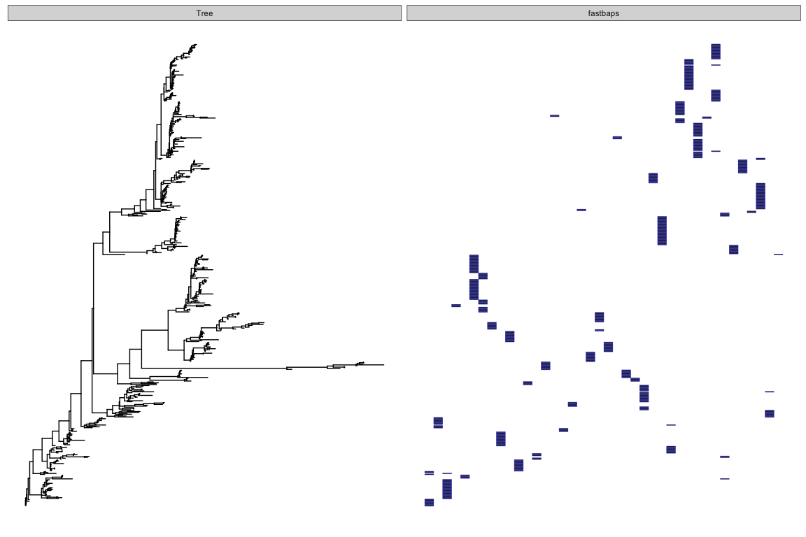
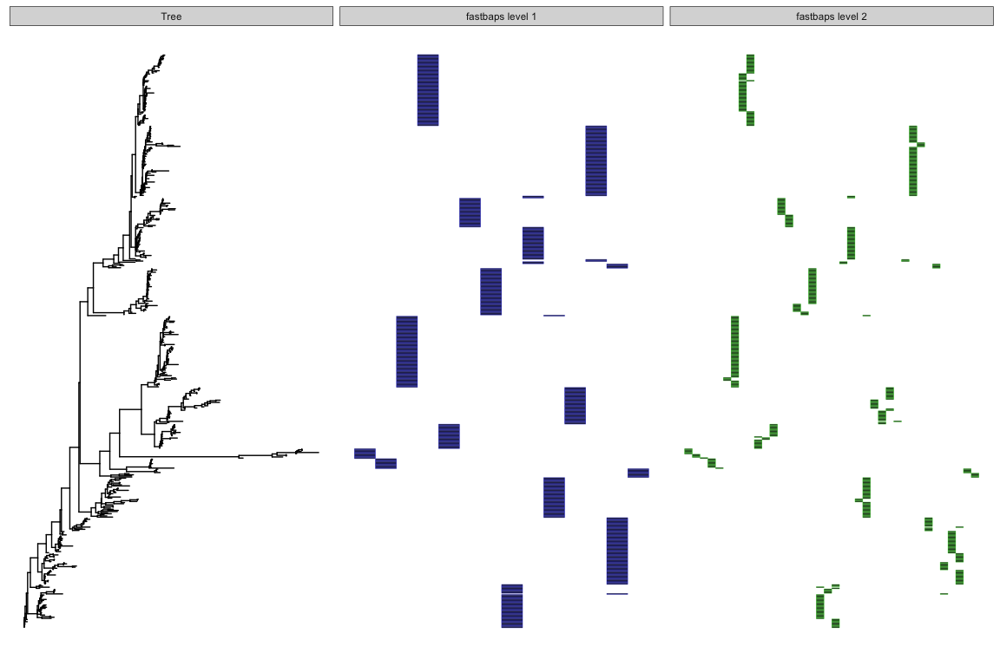
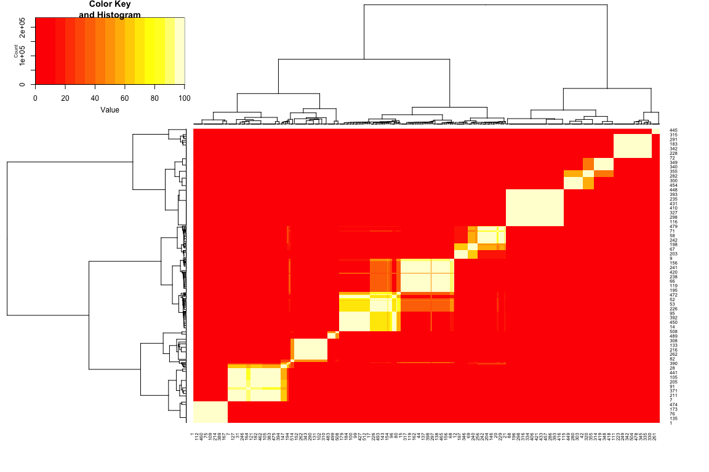

<!-- README.md is generated from README.Rmd. Please edit that file -->
<!-- badges: start -->

[](https://github.com/gtonkinhill/fastbaps/actions)
[](https://zenodo.org/badge/latestdoi/137083307)
<!-- badges: end -->

# fastbaps

## Installation

`fastbaps` is currently available on github. It can be installed with
`devtools`

``` r
install.packages("devtools")

devtools::install_github("gtonkinhill/fastbaps")
```

If you would like to also build the vignette with your installation run:

``` r
devtools::install_github("gtonkinhill/fastbaps", build_vignettes = TRUE)
```

### Conda

`fastbaps` can also be installed using Conda

    conda install -c conda-forge -c bioconda -c defaults r-fastbaps

## Choice of Prior

Fastbaps includes a number of options for the Dirichlet prior
hyperparamters. These range in order from most conservative to least as
`symmetric`, `baps`, `optimise.symmetric` and `optimise.baps`. The
choice of prior can be set using the `optimise_prior` function.

It is also possible to condition on a pre-existing phylogeny, which
allows a user to partition the phylogeny using the fastbaps algorithm.
This is described in more detail further down in the introduction.

## Quick Start

Run fastbaps.

**NOTE:** You need to replace the variable `fasta.file.name` with the
path to your fasta file. The system.file function is only used in this
example vignette.

``` r
# devtools::install_github('gtonkinhill/fastbaps')
library(fastbaps)
library(ape)

fasta.file.name <- system.file("extdata", "seqs.fa", package = "fastbaps")
sparse.data <- import_fasta_sparse_nt(fasta.file.name)
sparse.data <- optimise_prior(sparse.data, type = "optimise.symmetric")
#> [1] "Optimised hyperparameter: 0.02"
baps.hc <- fast_baps(sparse.data)
#> [1] "Calculating initial clustering..."
#> [1] "Calculating initial dk values..."
#> [1] "Clustering using hierarchical Bayesian clustering..."
clusters <- best_baps_partition(sparse.data, as.phylo(baps.hc))
#> [1] "Calculating node marginal llks..."
#> [1] "Finding best partition..."
```

All these steps can be combined and the algorithm run over multiple
levels by running

``` r
sparse.data <- optimise_prior(sparse.data, type = "optimise.symmetric")
#> [1] "Optimised hyperparameter: 0.02"
multi <- multi_res_baps(sparse.data)
```

## Command Line Script

The fastbaps package now includes a command line script. The location of
this script can be found by running

``` r
system.file("run_fastbaps", package = "fastbaps")
```

This script can then be copied to a location on the users path. If you
have installed fastbaps using conda, this will already have been done
for you.

## Citation

To cite fastbaps please use

> Tonkin-Hill,G., Lees,J.A., Bentley,S.D., Frost,S.D.W. and Corander,J.
> (2019) Fast hierarchical Bayesian analysis of population structure.
> Nucleic Acids Res., 10.1093/nar/gkz361.

## Introduction

The fast BAPS algorithm is based on applying the hierarchical Bayesian
clustering (BHC) algorithm of (Heller and Ghahramani 2005) to the
problem of clustering genetic sequences using the same likelihood as
BAPS (Cheng et al. 2013). The Bayesian hierarchical clustering can be
initiated with sequences as individual clusters or by running a faster
conventional hierarchical clustering initially followed by BHC of the
resulting clusters.

The algorithm has been written to take advantage of fast sparse matrix
libraries and is able to handle 1000’s of sequences and 100,000’s of
SNPs in under an hour on a laptop using a single core.

Alternatively, we can condition on an initial phylogentic or
hierarchical tree and provide the partition of the hierarchy that
maximises the BAPS likelihood. This is useful if the user is mainly
interested in partitioning an already calculated phylogeny. We have also
noticed that partitioning a hierarchy built using ward.D2 distance gives
very reasonable results, very quickly.

------------------------------------------------------------------------

## Libraries

``` r
library(fastbaps)
library(ggtree)
library(phytools)
library(ggplot2)
```

## Loading data

We first need to load a multiple sequence alignment into sparse format.
We can choose between the original BAPS prior or a prior proportional to
the mean frequency of each allele in the population.

``` r
fasta.file.name <- system.file("extdata", "seqs.fa", package = "fastbaps")
sparse.data <- import_fasta_sparse_nt(fasta.file.name)
```

Here we make use of the ‘optimised symmetric’ prior, which empirically
chooses the variance of the Dirichlet prior on the component mixtures.

``` r
sparse.data <- optimise_prior(sparse.data, type = "optimise.symmetric")
#> [1] "Optimised hyperparameter: 0.02"
```

## Running fastbaps

It is a good idea to choose `k.init` to be significantly larger than the
number of clusters you expect. By default it is set to the number of
sequences / 4.

``` r
baps.hc <- fast_baps(sparse.data)
#> [1] "Calculating initial clustering..."
#> [1] "Calculating initial dk values..."
#> [1] "Clustering using hierarchical Bayesian clustering..."
```

This provides a Bayesian hierarchical clustering of the data. To obtain
the partition of this hierarchy under Dirichlet Process Mixture model
run

``` r
best.partition <- best_baps_partition(sparse.data, baps.hc)
#> [1] "Calculating node marginal llks..."
#> [1] "Finding best partition..."
```

We can plot the output of the algorithm along with a pre-calculated tree
using ggtree (Yu et al. 2017).

``` r
newick.file.name <- system.file("extdata", "seqs.fa.treefile", package = "fastbaps")
iqtree <- phytools::read.newick(newick.file.name)
plot.df <- data.frame(id = colnames(sparse.data$snp.matrix), fastbaps = best.partition, 
    stringsAsFactors = FALSE)

gg <- ggtree(iqtree)

f2 <- facet_plot(gg, panel = "fastbaps", data = plot.df, geom = geom_tile, aes(x = fastbaps), 
    color = "blue")
f2
```

<!-- -->

We can compare this result to other priors, the un-optimised symmetric
or BAPS prior similar to STRUCTURE and hierBAPS, an optimised BAPS prior
or the population mean based prior of Heller et al.

``` r
sparse.data <- optimise_prior(sparse.data, type = "baps")

baps.hc <- fast_baps(sparse.data)
#> [1] "Calculating initial clustering..."
#> [1] "Calculating initial dk values..."
#> [1] "Clustering using hierarchical Bayesian clustering..."
best.partition <- best_baps_partition(sparse.data, baps.hc)
#> [1] "Calculating node marginal llks..."
#> [1] "Finding best partition..."

plot.df <- data.frame(id = colnames(sparse.data$snp.matrix), fastbaps = best.partition, 
    stringsAsFactors = FALSE)

gg <- ggtree(iqtree)
f2 <- facet_plot(gg, panel = "fastbaps", data = plot.df, geom = geom_tile, aes(x = fastbaps), 
    color = "blue")
f2
```

<!-- -->

we can also use the same prior as used in the BHC algorithm of Heller et
al. However this tends to overpartition population genetic data.

``` r
sparse.data <- optimise_prior(sparse.data, type = "hc")
#> [1] "Optimised hyperparameter: 0.286"

baps.hc <- fast_baps(sparse.data)
#> [1] "Calculating initial clustering..."
#> [1] "Calculating initial dk values..."
#> [1] "Clustering using hierarchical Bayesian clustering..."
best.partition <- best_baps_partition(sparse.data, baps.hc)
#> [1] "Calculating node marginal llks..."
#> [1] "Finding best partition..."

plot.df <- data.frame(id = colnames(sparse.data$snp.matrix), fastbaps = best.partition, 
    stringsAsFactors = FALSE)

gg <- ggtree(iqtree)
f2 <- facet_plot(gg, panel = "fastbaps", data = plot.df, geom = geom_tile, aes(x = fastbaps), 
    color = "blue")
f2
```

<!-- -->

we can also investigate multiple levels

``` r
sparse.data <- import_fasta_sparse_nt(fasta.file.name)
multi <- multi_res_baps(sparse.data)

plot.df <- data.frame(id = colnames(sparse.data$snp.matrix), fastbaps = multi$`Level 1`, 
    fastbaps2 = multi$`Level 2`, stringsAsFactors = FALSE)

gg <- ggtree(iqtree)

f2 <- facet_plot(gg, panel = "fastbaps level 1", data = plot.df, geom = geom_tile, 
    aes(x = fastbaps), color = "blue")
f2 <- facet_plot(f2, panel = "fastbaps level 2", data = plot.df, geom = geom_tile, 
    aes(x = fastbaps2), color = "green")
f2
```

<!-- -->

We can also partition an initial hierarchy or phylogeny.

``` r
sparse.data <- import_fasta_sparse_nt(fasta.file.name, prior = "baps")

iqtree.rooted <- phytools::midpoint.root(iqtree)
best.partition <- best_baps_partition(sparse.data, iqtree.rooted)
#> [1] "Calculating node marginal llks..."
#> [1] "Finding best partition..."

plot.df <- data.frame(id = iqtree.rooted$tip.label, fastbaps = best.partition, stringsAsFactors = FALSE)

gg <- ggtree(iqtree.rooted)
f2 <- facet_plot(gg, panel = "fastbaps", data = plot.df, geom = geom_tile, aes(x = fastbaps), 
    color = "blue")
f2
```

<!-- -->

finally we can also look at the stability of the inferred clusters using
the Bootstrap

``` r
sparse.data <- optimise_prior(sparse.data, type = "optimise.symmetric")
#> [1] "Optimised hyperparameter: 0.02"
boot.result <- boot_fast_baps(sparse.data)
dendro <- as.dendrogram(fast_baps(sparse.data))
#> [1] "Calculating initial clustering..."
#> [1] "Calculating initial dk values..."
#> [1] "Clustering using hierarchical Bayesian clustering..."
gplots::heatmap.2(boot.result, dendro, dendro, tracecol = NA)
```

<!-- -->

## References

<div id="refs" class="references csl-bib-body hanging-indent">

<div id="ref-Cheng2013-mp" class="csl-entry">

Cheng, Lu, Thomas R Connor, Jukka Sirén, David M Aanensen, and Jukka
Corander. 2013. “Hierarchical and Spatially Explicit Clustering of DNA
Sequences with BAPS Software.” *Mol. Biol. Evol.* 30 (5): 1224–28.
<https://doi.org/10.1093/molbev/mst028>.

</div>

<div id="ref-Heller2005-kp" class="csl-entry">

Heller, Katherine A, and Zoubin Ghahramani. 2005. “Bayesian Hierarchical
Clustering.” In *Proceedings of the 22Nd International Conference on
Machine Learning*, 297–304. ICML ’05. New York, NY, USA: ACM.
<https://doi.org/10.1145/1102351.1102389>.

</div>

<div id="ref-Kalyaanamoorthy2017-go" class="csl-entry">

Kalyaanamoorthy, Subha, Bui Quang Minh, Thomas K F Wong, Arndt von
Haeseler, and Lars S Jermiin. 2017. “ModelFinder: Fast Model Selection
for Accurate Phylogenetic Estimates.” *Nat. Methods* 14 (6): 587–89.
<https://doi.org/10.1038/nmeth.4285>.

</div>

<div id="ref-Paradis2004-ck" class="csl-entry">

Paradis, Emmanuel, Julien Claude, and Korbinian Strimmer. 2004. “APE:
Analyses of Phylogenetics and Evolution in R Language.” *Bioinformatics*
20 (2): 289–90. <https://doi.org/10.1093/bioinformatics/btg412>.

</div>

<div id="ref-Revell2012-ik" class="csl-entry">

Revell, Liam J. 2012. “Phytools: An R Package for Phylogenetic
Comparative Biology (and Other Things).” *Methods Ecol. Evol.* 3 (2):
217–23. <https://doi.org/10.1111/j.2041-210X.2011.00169.x>.

</div>

<div id="ref-Tonkin-Hill2019-lc" class="csl-entry">

Tonkin-Hill, Gerry, John A Lees, Stephen D Bentley, Simon D W Frost, and
Jukka Corander. 2019. “Fast Hierarchical Bayesian Analysis of Population
Structure.” *Nucleic Acids Res.*, May.
<https://doi.org/10.1093/nar/gkz361>.

</div>

<div id="ref-Yu2017-bf" class="csl-entry">

Yu, Guangchuang, David K Smith, Huachen Zhu, Yi Guan, and Tommy Tsan-Yuk
Lam. 2017. “Ggtree: An r Package for Visualization and Annotation of
Phylogenetic Trees with Their Covariates and Other Associated Data.”
*Methods Ecol. Evol.* 8 (1): 28–36.
<https://doi.org/10.1111/2041-210X.12628>.

</div>

</div>
